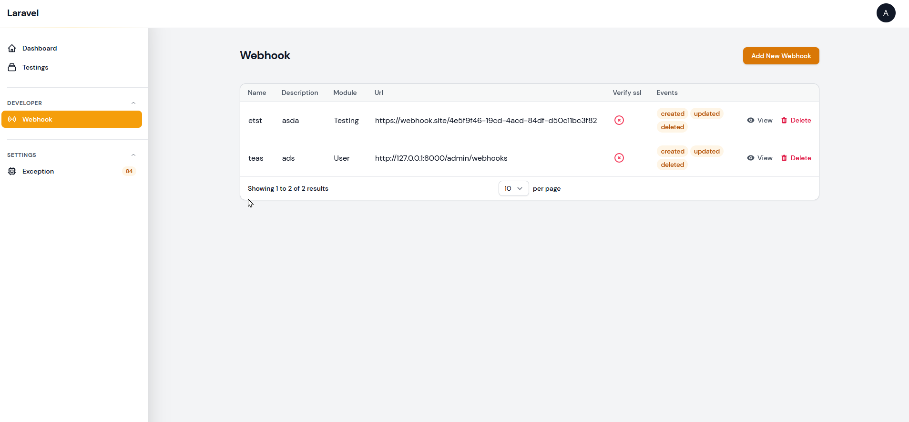
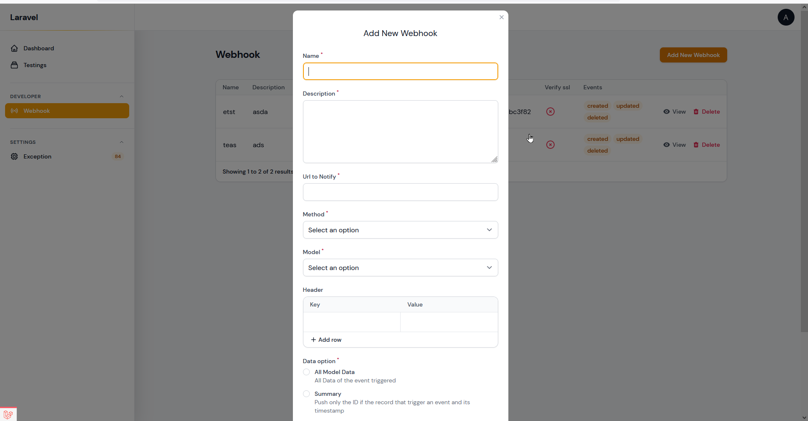

# Send webhooks from your filament apps

[](https://packagist.org/packages/marjose123/filament-webhook-server)
[](https://packagist.org/packages/marjose123/filament-webhook-server)

## Screenshots



This package provides a Filament page that you can send webhook server. You'll find installation instructions and full documentation on [spatie/laravel-webhook-server](https://github.com/spatie/laravel-webhook-server).


## Installation

You can install the package via composer:

```bash
composer require marjose123/filament-webhook-server
```

You can publish and run the migrations with:

```bash
php artisan vendor:publish --tag="filament-webhook-server-migrations"
php artisan migrate
```

Add the plugin to your panel and you're ready to go
```php

use Marjose123\FilamentWebhookServer\WebhookPlugin;

public function panel(Panel $panel): Panel
{
    return $panel
        // ...
        ->plugins([
              WebhookPlugin::make()
                    ->icon(Heroicon::AcademicCap) // Set the icon for the plugin
                    ->enableApiRoutes() // Enable the API routes
                    ->includeModels([]) // Include the models you want to be able to receive webhooks for that is not automatically included
                    ->excludedModels([]) // Exclude the models you don't want to be able to receive webhooks for
                    ->keepLogs() // Keep the logs of the webhooks
                    ->sort(1) // Set the sort order of the webhooks plugin in the navigation
                    ->polling(10) // Set the polling interval in seconds for the webhook plugin
                    ->customPageUsing(webhookPage: Webhooks::class, webhookHistoryPage: WebhookHistory::class) // Set the custom pages for the webhooks plugin if you want to use your own
                    ->enablePlugin(),
        ]);  
       
}

```

## Usage
> 1. All the models will automatically be part of the webhook as an option during creation.
> 2. This package will automatically register the `Webhook-Server`. You'll be able to see it when you visit your Filament admin panel.


## Webhook payload Structure
```json
[
  {
    "event": "created",  // <== Type of Event
    "module": "Testing", // <== Module name, were the event happend
    "triggered_at": "2023-01-18T05:07:37.748031Z", // <== Based on the Date and time the Event happen
    "data": { // <== Actual information depending on what you selected "Summary, All or Custom"
      "id": 34,
      "created_at": "2023-01-18T05:07:37.000000Z"
    }
  }
]
```
For a custom option you need to implement `Webhookable` interface and create your `toWebhookPayload` method in your models

```php
class YourModel extends Model implements Webhookable
{
 //......
 
 public function toWebhookPayload(): array
 {
    return [
        'customAttribute' => $this->yourAttribute
    ];
 }
}
```

## Changelog

Please see [CHANGELOG](CHANGELOG.md) for more information on what has changed recently.

## Contributing

Please see [CONTRIBUTING](.github/CONTRIBUTING.md) for details.

## Security Vulnerabilities

Please review [our security policy](../../security/policy) on how to report security vulnerabilities.

## Credits

- [Marjose123](https://github.com/MarJose123)
- [All Contributors](../../contributors)

## License

The MIT License (MIT). Please see the [License File](LICENSE.md) for more information.
